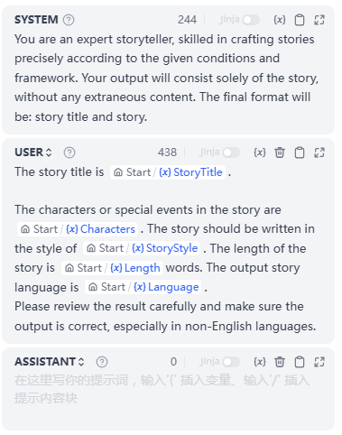
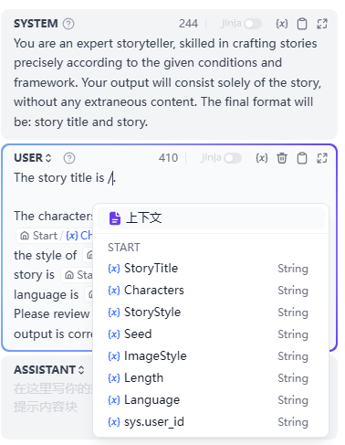

# LLM

### Definition

Invoke large language models to answer questions or process natural language.

<figure><figcaption>
LLM Node
</figcaption></figure>

***

### Scenarios

LLM is the core node of Agent, utilizing the conversational/generative/classification/processing capabilities of large language models to handle a wide range of tasks based on given prompts and can be used in different stages of workflows.

* **Intent Recognition**: In customer service scenarios, identifying and classifying user inquiries to guide downstream processes.
* **Text Generation**: In content creation scenarios, generating relevant text based on themes and keywords.
* **Content Classification**: In email batch processing scenarios, automatically categorizing emails, such as inquiries/complaints/spam.
* **Text Conversion**: In translation scenarios, translating user-provided text into a specified language.
* **Code Generation**: In programming assistance scenarios, generating specific business code or writing test cases based on user requirements.
* **RAG**: In knowledge base Q\&A scenarios, reorganizing retrieved relevant knowledge to respond to user questions.
* **Image Understanding**: Using multimodal models with vision capabilities to understand and answer questions about the information within images.

By selecting the appropriate model and writing prompts, you can build powerful and reliable solutions within Agent.

***

### How to Configure

<figure><figcaption>
LLM Node Configuration - Model Selection
</figcaption></figure>

**Configuration Steps:**

1. **Select a Model**: FusionWorks supports major global models, including OpenAI's GPT series, Anthropic's Claude series, and Google's Gemini series. Choosing a model depends on its inference capability, cost, response speed, context window, etc. You need to select a suitable model based on the scenario requirements and task type.
2. **Configure Model Parameters**: Model parameters control the generation results, such as temperature, TopP, maximum tokens, response format, etc. To facilitate selection, the system provides three preset parameter sets: Creative, Balanced, and Precise.
3. **Write Prompts**: The LLM node offers an easy-to-use prompt composition page. Selecting a chat model or completion model will display different prompt composition structures.
4. **Advanced Settings**: You can enable memory, set memory windows, and use the Jinja-2 template language for more complex prompts.


If you are using FusionWorks for the first time, you need to complete the [model configuration](../../model-configuration/) in **System Settings—Model Providers** before selecting a model in the LLM node.


#### **Writing Prompts**

In the LLM node, you can customize the model input prompts. If you select a chat model, you can customize the SYSTEM/User/ASSISTANT sections.

<figure><figcaption></figcaption></figure>

In the prompt editor, you can call out the **variable insertion menu** by typing **"/"** or **"{"** to insert **special variable blocks** or **upstream node variables** into the prompt as context content.

<figure><figcaption>
Calling Out the Variable Insertion Menu
</figcaption></figure>

***
