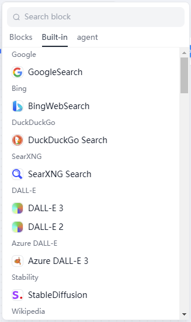

# Tools

### Definition

The agent workflow provides a rich selection of tools. Before using built-in tools, you may need to **authorize** the tools.

<figure><figcaption>
Tool Selection
</figcaption></figure>

Configuring a tool node generally involves two steps:

1. Authorizing the tool/creating a custom tool/publishing a agent as a tool.
2. Configuring the tool's input and parameters.
