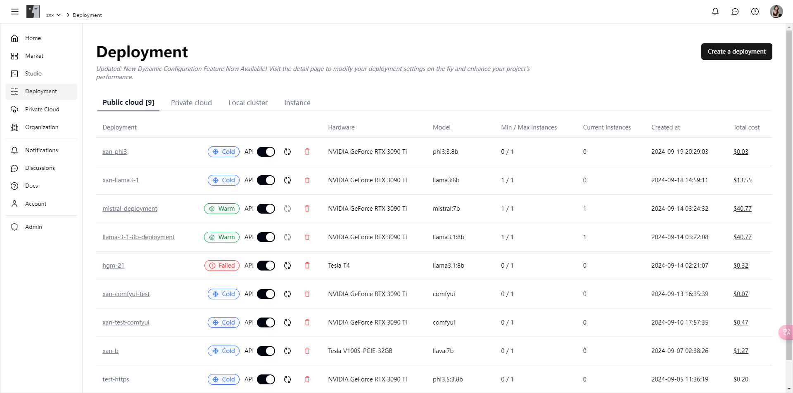
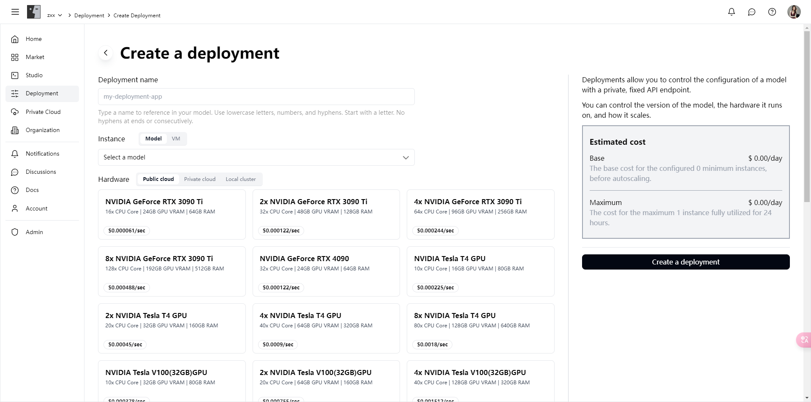
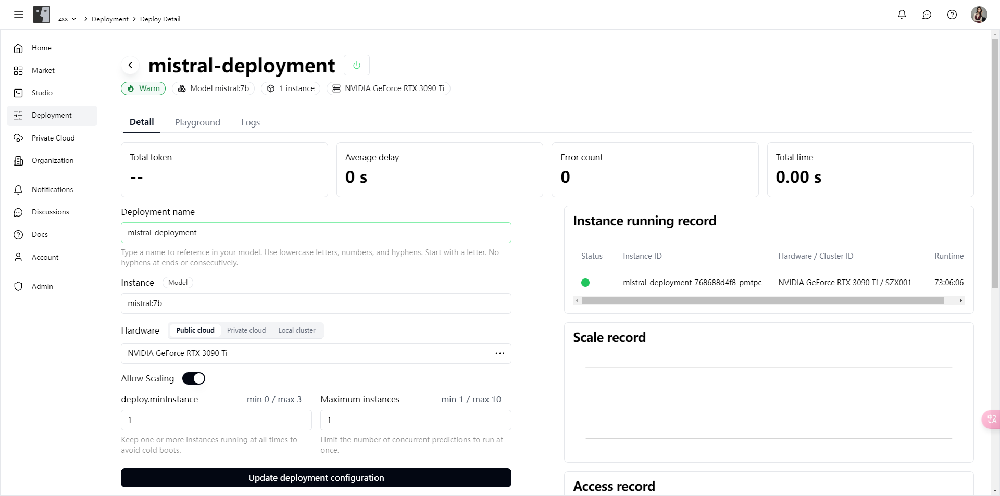

# Deployment

Here, you can easily create and manage model deployments, fully utilizing our rich computing resources and professional elastic scaling configurations to maximize your project's performance.

### Features

**1. Diverse Computing Resources**

* **Rich Hardware Selection**: Support for various high-performance hardware, from NVIDIA GeForce RTX 3090 Ti to Tesla T4, meeting your different computing needs.
* **Flexible Deployment Environments**: Support for public cloud, private cloud, and local clusters, helping you choose the most suitable deployment environment based on project requirements.

**2. Simple Deployment Process**

* **One-Click Deployment Creation**: Just fill in the deployment name, select the model and hardware, and the system will automatically configure and start the deployment for you.
* **Real-Time Cost Estimation**: During the deployment process, the system will display the estimated cost in real-time, helping you better budget and plan.

**3. Powerful Elastic Scaling**

* **Automatic Scaling Configuration**: Automatically adjust the number of instances based on actual demand, ensuring maximum resource utilization.
* **Flexible Min/Max Instance Settings**: Allows you to set the minimum and maximum number of instances, ensuring smooth operation even during peak periods.

**4. Detailed Usage Dashboard**

* **Comprehensive Status Monitoring**: Provides detailed deployment status, instance running records, scaling records, and access records, giving you a clear overview of the deployment situation.
* **Usage Experience Module**: Built-in experience module, you can interact with the model directly on the platform to test and validate its effects.
* **Log Records**: Detailed log recording function helps you track and analyze each call and response, quickly locate and solve problems.

### Introduction

#### **Deployment Overview**

In the deployment overview page, you can view all created deployments and understand the status, hardware configuration, model type, number of instances, and cumulative cost of each deployment.

<figure><figcaption></figcaption></figure>

#### **Create Deployment**

In the create deployment page, you only need to enter the deployment name, select the model and hardware configuration, and you can create the deployment with one click. The system will provide detailed cost estimation to help you better control your budget.

<figure><figcaption></figcaption></figure>

#### **Deployment Details**

In the deployment details page, you can view detailed information about the deployment, including instance running records, scaling records, and access records. Through the experience module, you can interact directly with the model to test its functionality and effectiveness.

<figure><figcaption></figcaption></figure>

#### **Log Records**

In the log records page, you can view detailed logs of each call, understand the call status, runtime, and generated content, making it convenient for you to analyze and debug.

<figure><figcaption></figcaption></figure>

### Get Started Now

Enter the [deployment module](https://alpha.fusionworks.ai/) now, create your first deployment, and enjoy the powerful computing resources and flexible configurations provided by our platform, enhancing your project performance and user experience!
