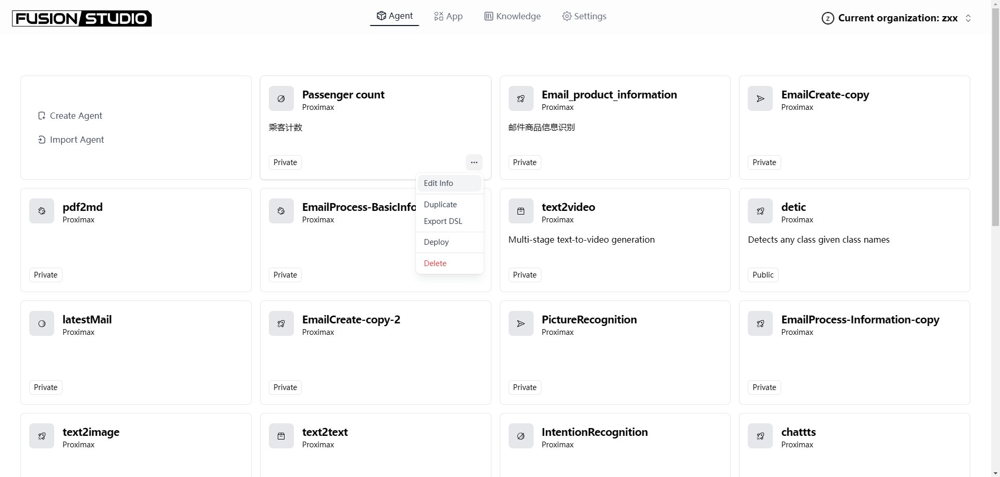

# Manage App

### Editing Application Information

After creating an application, if you want to modify the application name or description, you can click "Edit info" in the lower right corner of the application card to revise the application's icon, name, or description.

<figure><figcaption>
Edit App Info
</figcaption></figure>

### Duplicating Application

All applications support copying. Click "Duplicate" in the lower right corner of the application.

### Switch to Workflow Orchestrate

TODO 🚧

### Exporting Application

Applications created in FusionWorks can be exported in DSL format. You can freely import the configuration file into any FusionWorks workspace.


FusionWorks DSL is an AI application engineering file standard defined by FusionWorks.AI in v0.6 and later. The file format is YML. This standard covers the basic description of the application, model parameters, orchestration configuration, and other information.


### Deleting Application

If you want to remove an application, you can click "Delete" in the lower right corner of the application.


⚠️ The deletion of an application cannot be undone. All users will be unable to access your application, and all prompts, orchestration configurations, and logs within the application will be deleted.

