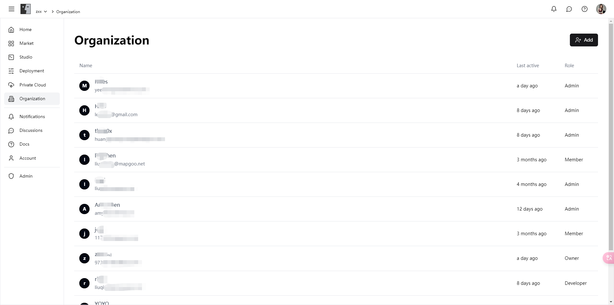

# Organization

Here, you can easily manage all members of your current organization, assign different roles and permissions to ensure efficient team collaboration and optimal resource utilization.

### Features

**1. Role Management**

We provide various role options to help you manage members precisely based on their responsibilities and permission needs:

* **Owner**: The owner of the current organization, with all permissions, including managing members, resources, agent development, and organization settings.
* **Admin**: Can manage members, resources, and agent development, ensuring efficient use of organizational resources and smooth business operations.
* **Developer**: Focuses on agent development, with permissions to develop and test models, driving technical innovation and project progress.
* **Member**: Has read-only permissions, can view resources and information within the organization, ensuring transparency and team collaboration.

**2. Member Management**

* **Add Members**: Quickly add new members to the organization through simple operations and assign appropriate roles.
* **Role Assignment**: Flexibly assign and adjust member roles to ensure each member has suitable permissions, enhancing team efficiency.
* **Activity Monitoring**: View each member's last active time in real-time, understanding their participation and activity status.

### Introduction

#### **Member List**

In the member list page, you can view detailed information about all organization members, including name, email, role, and last active time. Through simple operations, you can add new members, adjust member roles, and remove members.

<figure><figcaption></figcaption></figure>

#### **Role Assignment**

In the role assignment page, you can flexibly adjust each member's role based on their responsibilities and permission needs, ensuring efficient team collaboration and optimal resource utilization.

<figure><figcaption></figcaption></figure>

### Get Started Now

Enter the [organization module](https://alpha.fusionworks.ai/) now, manage your team members, assign appropriate roles and permissions, ensure efficient team collaboration and optimal resource utilization, and enhance project performance and team productivity!
