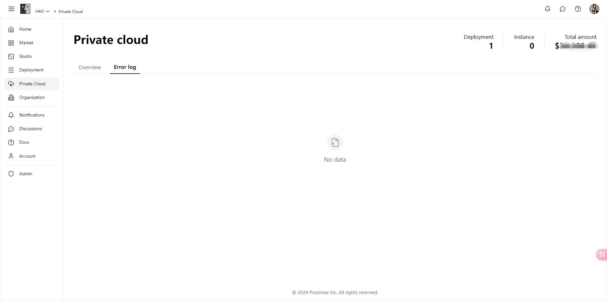

# Private Cloud

Here, you can comprehensively view and manage the utilization of your purchased private cloud resources, ensuring that your projects always have sufficient computing power and resource support.

### Features

**1. Resource Overview**

* **Real-Time Status Monitoring**: Detailed display of the current usage status of each private cloud resource, including online status, remaining usage time, hardware configuration, etc.
* **Resource Usage Statistics**: Provides real-time usage of CPU, GPU, memory, storage, and other resources to help you better understand resource utilization.

**2. Deployment Management**

* **Convenient Deployment Viewing**: In the private cloud module, you can view all deployments created on private cloud resources, understanding the status, hardware configuration, model type, number of instances, and cumulative cost of each deployment.
* **Flexible Instance Management**: Supports starting, stopping, and deleting instances, helping you manage computing resources flexibly to ensure efficient resource utilization.

**3. Error Logs**

* **Comprehensive Error Log Records**: In the error log page, you can view all error logs generated during the use of private cloud resources, making it easy to quickly locate and solve problems.
* **Real-Time Error Notifications**: The system will monitor the running status of private cloud resources in real-time and notify you promptly in case of errors, ensuring that issues can be addressed as soon as possible.

### Introduction

#### **Resource Overview**

In the resource overview page, you can view detailed information about each private cloud resource, including hardware configuration, online status, remaining usage time, and costs. The system also displays real-time usage of various resources, helping you comprehensively understand resource utilization.

<figure><figcaption></figcaption></figure>

<figure><figcaption></figcaption></figure>

#### **Deployment Management**

In the deployment management page, you can view all deployments created on private cloud resources, understanding the status, hardware configuration, model type, number of instances, and cumulative cost of each deployment. You can also manage these deployments flexibly, including starting, stopping, and deleting instances.

<figure><figcaption></figcaption></figure>

#### **Error Logs**

In the error log page, you can view all error logs generated during the use of private cloud resources. The system records detailed information about each error, including the occurrence time, error type, and detailed information, helping you quickly locate and solve problems.

<figure><figcaption></figcaption></figure>

### Get Started Now

Enter the [private cloud module](https://alpha.fusionworks.ai/) now to comprehensively understand and manage your private cloud resources, ensuring that your projects always have sufficient computing power and resource support, enhancing project performance and user experience!
