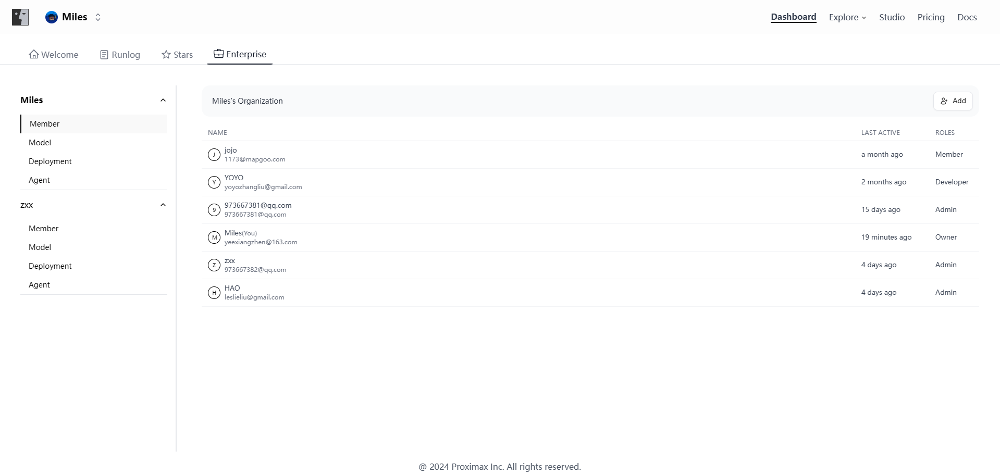

# Inviting and Managing Members

Members of a workspace can be invited and managed by the owner and administrators. After logging in, navigate to "Console - Enterprise" in FusionWorks, and open the member management interface from the Members tab on the left side of this page.

<figure><figcaption>
member management interface
</figcaption></figure>

### Inviting Members

Provide the email of the invitee. The system will immediately grant the invitee access to the workspace, and the invitee will also receive an email notification.

The system will automatically create a FusionWorks account for the new member.

### Removing Members

Once a member is removed from the team, they will no longer have access to the current workspace. However, this will not affect their access to other workspaces they have already joined.

### Member Management

In a workspace, members can be categorized into four roles: Workspace Owner, Admin, Developer, and Member. 
1. The Workspace Owner can manage the roles of all members within the workspace. 
2. The Admin can manage the roles of all members within the workspace except for the Workspace Owner and other Admins. 
3. The Developer can create and modify agents within the workspace.
4. The Member can only access and interact with the agents within the workspace.