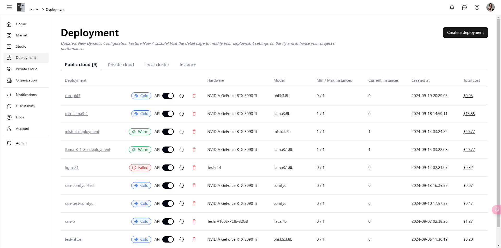
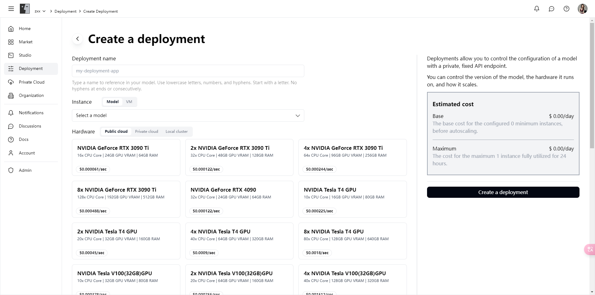
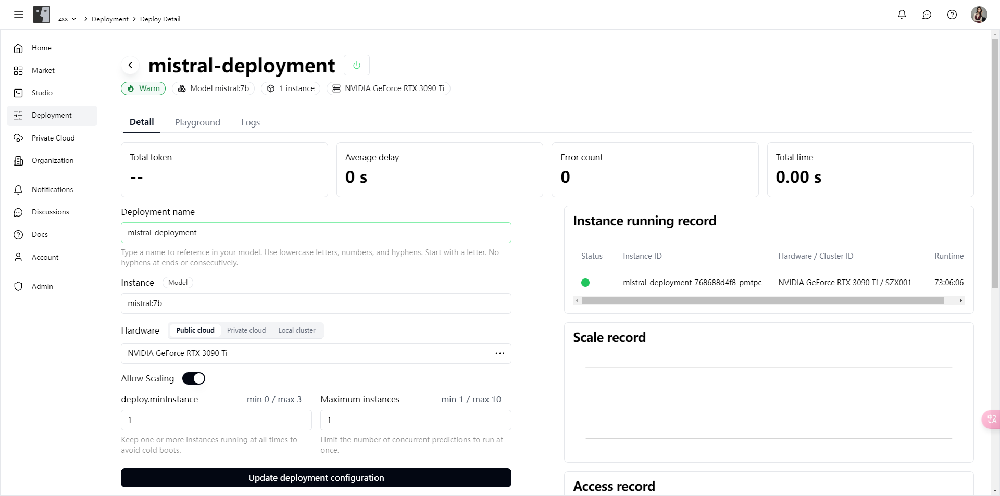
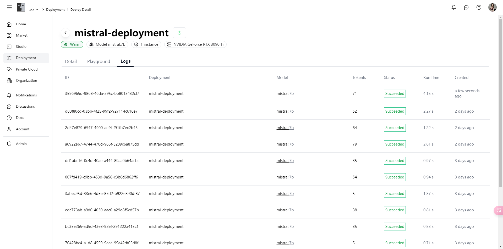

# 部署

轻松创建和管理模型的部署，充分利用我们丰富的算力资源和专业的弹性伸缩配置，让您的项目性能得到最大化提升。

### 功能亮点

**1. 多样的计算资源**

* **丰富的硬件选择**：支持多种高性能硬件，从NVIDIA GeForce RTX 3090 Ti到NVIDIA H100，满足您不同的计算需求。
* **灵活的部署环境**：支持公有云、私有云和本地集群，帮助您根据项目需求选择最合适的部署环境。

**2. 简便的部署流程**

* **一键创建部署**：只需填写部署名称、选择模型和硬件，系统将为您自动配置并启动部署。
* **实时成本估算**：在部署过程中，系统会实时显示预计成本，帮助您更好地预算和规划。

**3. 强大的弹性伸缩**

* **自动扩展配置**：根据实际需求自动调整实例数量，确保资源利用率最大化。
* **灵活的最小/最大实例设置**：允许您设置最小和最大实例数量，确保在高峰期也能平稳运行。

**4. 详细的使用面板**

* **全面的状态监控**：提供详细的部署状态、实例运行记录、缩放记录和访问记录，让您对部署情况一目了然。
* **使用体验模块**：内置体验模块，您可以直接在平台上与模型进行交互，测试和验证模型效果。
* **日志记录**：详细的日志记录功能，帮助您追踪和分析每一次调用和响应，快速定位和解决问题。

### 功能介绍

#### **部署总览**

在部署总览页面，您可以查看所有已创建的部署，了解每个部署的状态、硬件配置、模型类型、实例数量以及累计成本。

<figure><figcaption></figcaption></figure>

**创建部署**

在创建部署页面，您只需输入部署名称，选择模型和硬件配置，即可一键创建部署。系统会为您提供详细的成本估算，帮助您更好地控制预算。

<figure><figcaption></figcaption></figure>

**部署详情**

在部署详情页面，您可以查看部署的详细信息，包括实例运行记录、缩放记录和访问记录。通过体验模块，您可以直接与模型交互，测试其功能和效果。

<figure><figcaption></figcaption></figure>

**日志记录**

在日志记录页面，您可以查看每一次调用的详细日志，了解调用状态、运行时间和生成的内容，方便您进行分析和调试。

<figure><figcaption></figcaption></figure>

### 立即体验

立即进入[部署模块](https://alpha.fusionworks.ai/)，创建您的第一个部署，享受我们平台提供的强大算力和灵活配置，提升您的项目性能和用户体验！
