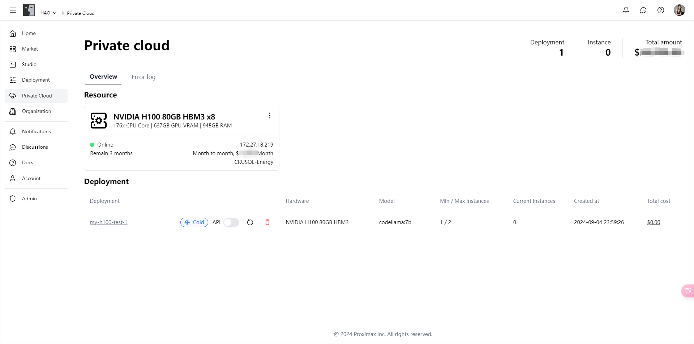
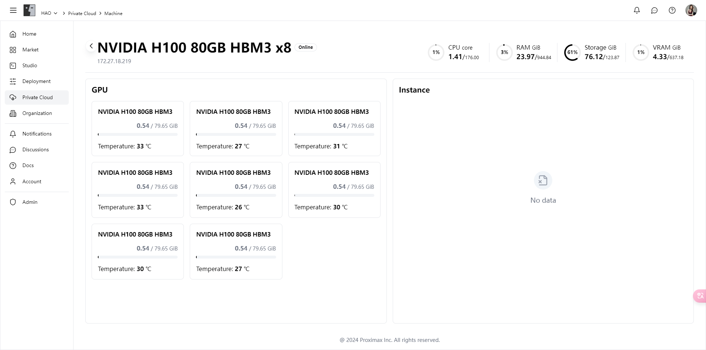
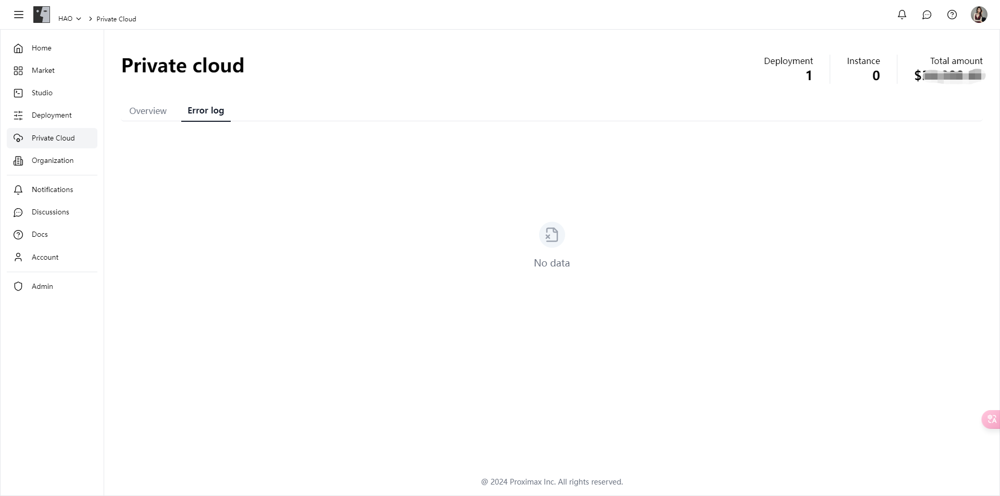

# 专有云

全面了解和管理自己购买的专有云资源使用情况，确保您的项目始终拥有充足的计算能力和资源支持。

### 功能亮点

**1. 资源概览**

* **实时状态监控**：详细展示每个专有云资源的当前使用状态，包括在线状态、剩余使用时间、硬件配置等信息。
* **资源使用统计**：提供CPU、GPU、内存、存储等资源的实时使用情况，帮助您更好地了解资源利用率。

**2. 部署管理**

* **便捷的部署查看**：在专有云模块中，您可以查看所有在专有云资源上创建的部署，了解每个部署的状态、硬件配置、模型类型、实例数量以及累计成本。
* **灵活的实例管理**：支持启动、停止、删除实例，帮助您灵活管理计算资源，确保资源的高效利用。

**3. 错误日志**

* **全面的错误日志记录**：在错误日志页面，您可以查看专有云资源在使用过程中产生的所有错误日志，方便您快速定位和解决问题。
* **实时错误通知**：系统会实时监控专有云资源的运行状态，并在发生错误时及时通知您，确保问题能够尽快得到处理。

### 功能介绍

#### **资源概览**

在资源概览页面，您可以查看每个专有云资源的详细信息，包括硬件配置、在线状态、剩余使用时间和费用等。系统还会实时显示各项资源的使用情况，帮助您全面了解资源利用率。

<figure><figcaption></figcaption></figure>

<figure><figcaption></figcaption></figure>

#### **部署管理**

在部署管理页面，您可以查看所有在专有云资源上创建的部署，了解每个部署的状态、硬件配置、模型类型、实例数量以及累计成本。您还可以灵活管理这些部署，包括启动、停止和删除实例。

<figure><figcaption></figcaption></figure>

#### **错误日志**

在错误日志页面，您可以查看专有云资源在使用过程中产生的所有错误日志。系统会详细记录每个错误的发生时间、错误类型和详细信息，帮助您快速定位和解决问题。

<figure><figcaption></figcaption></figure>

### 立即体验

立即进入[专有云模块](https://alpha.fusionworks.ai/)，全面了解和管理您的专有云资源，确保您的项目始终拥有充足的计算能力和资源支持，提升项目性能和用户体验！
