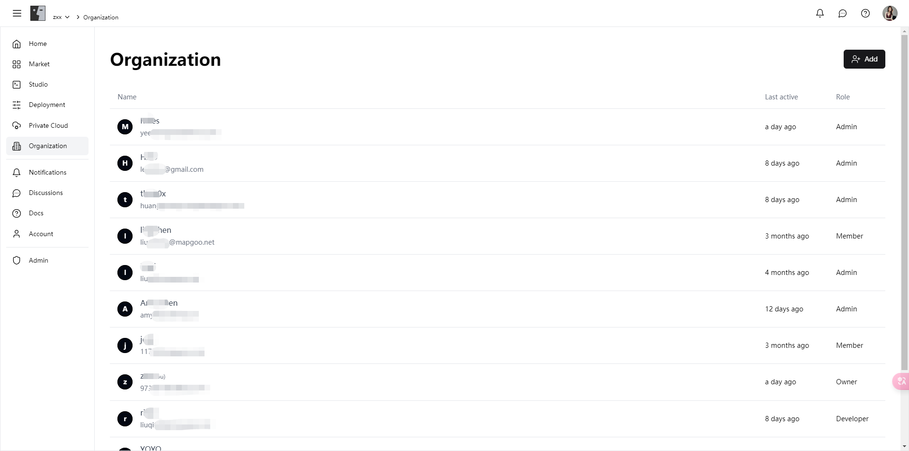

# 组织

方便地管理当前组织的所有成员，分配不同的角色和权限，以确保团队高效协作和资源的最佳利用。

### 功能亮点

**1. 角色管理**

我们提供多种角色选择，帮助您根据成员的职责和权限需求进行精细化管理：

* **拥有者 (Owner)**：当前组织的所有者，拥有所有权限，包括管理成员、资源、智能体开发和组织设置等。
* **管理员 (Admin)**：可以管理成员、资源和智能体开发，确保组织资源的高效利用和业务的顺利进行。
* **开发者 (Developer)**：专注于智能体开发，拥有开发和测试模型的权限，推动技术创新和项目进展。
* **成员 (Member)**：仅具有查阅权限，可以查看组织内的资源和信息，确保信息透明和团队协作。

**2. 成员管理**

* **添加成员**：通过简单的操作，您可以快速添加新成员到组织中，并为其分配合适的角色。
* **角色分配**：灵活分配和调整成员的角色，确保每个成员拥有合适的权限，提升团队效率。
* **活动监控**：实时查看每个成员的最后活跃时间，了解成员的参与度和活跃情况。

### 功能介绍

#### **成员列表**

在成员列表页面，您可以查看所有组织成员的详细信息，包括姓名、邮箱、角色和最后活跃时间。通过简单的操作，您可以添加新成员、调整成员角色和删除成员。

<figure><figcaption></figcaption></figure>

#### **角色分配**

您可以灵活调整每个成员的角色，根据他们的职责和权限需求进行精细化管理，确保团队高效协作和资源的最佳利用。

<figure><figcaption></figcaption></figure>

### 立即体验

立即进入[组织模块](https://alpha.fusionworks.ai/)，管理您的团队成员，分配合适的角色和权限，确保团队高效协作和资源的最佳利用，提升项目绩效和团队生产力！
